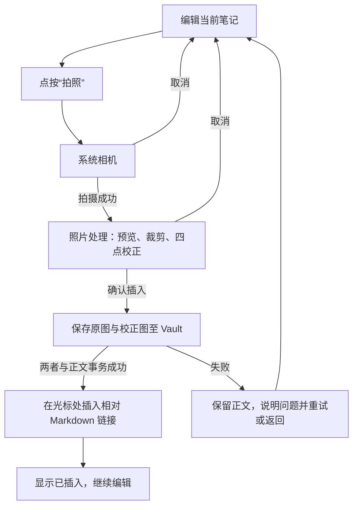

# 拍照 → 处理 → Markdown 流程

## 目标与不可变条件

此流程让用户从当前笔记快速拍照、按需裁剪或校正后插入。系统相机负责拍摄；Markbook 负责把结果安全写入用户 Vault，并插入相对 Markdown 链接。首版不含 OCR、标注、视频、音频或云端识别。

附件路径、命名、原图保留与事务恢复以 [共享 Vault 契约](../specs/004-harmony-4-5-compatibility/contracts/vault-contract.md) 和 [拍照附件规格](../specs/002-camera-attachments/spec.md) 为准。本文不允许为方便预览而把临时 URI 或设备绝对路径写入 Markdown。

## 用户流程

## 1. 从编辑器启动相机

- 用户在当前笔记顶部栏点按“拍照”。若正文尚有待保存变化，先尝试保存；保存不能完成时，说明无法安全开始插入，并允许用户重试或继续编辑。
- 调用系统相机。进入系统界面前保留当前正文、光标与滚动位置；相机取消是正常返回，不显示错误，不修改正文。
- 拍摄后先验证结果可读取，再进入处理页。相机失败、返回内容不可读或权限被拒绝时，显示简明原因与“重试”“返回笔记”；不得插入空链接。

## 2. 处理页

处理页以照片预览为中心，顶部提供返回/取消和“调整照片”上下文，底部固定一个明确的“插入照片”主操作。裁剪模式与四点校正模式必须显示文字和选中状态；进入页面即显示默认矩形选区与四个可拖动控制点，不能要求用户先点按模式按钮才能开始调整。

- 默认显示完整预览与初始矩形。提供矩形裁剪，以及可单独拖动四角的透视校正。
- 拖点应有足够热区、对比度和按压反馈；缩放或旋转不应导致角点难以定位。
- 处理过程较长时显示进度但保持取消可用；不能长时间冻结界面。
- “取消”仅丢弃本次临时拍摄和处理结果，回到原编辑位置；不改动已保存照片或正文。
- “插入照片”前可显示最终预览；确认后立即进入写入状态，防止重复点击；写入失败时留在可恢复上下文并提供“重试”或“返回笔记”。
- 从编辑器进入处理页时，过渡应让用户理解这是当前笔记中的同一张照片；取消或插入完成后返回原光标与滚动位置。不要使用长时间、循环或无法中断的装饰动效。

## 3. 事务性落盘与插入

1. 将原图与用户确认的校正/裁剪结果写入当前笔记对应的 `assets/<笔记文件名>/`。
2. 生成与真实 MIME 格式一致的扩展名，检查命名冲突，并只使用 Vault 内 POSIX 相对路径。
3. 原图和校正图都成功准备后，向正文当前光标处插入默认指向校正图的 Markdown 图片链接。
4. 正文与附件都完成可恢复写入后，显示“照片已插入”；光标位于图片链接之后。

任一步失败都不能产生“正文已引用、图片不存在”的状态。根据事务标记恢复或清理临时文件；不得删除已完成的内容。处理后的图片是默认可见版本，原图仍在 Vault 中可追溯。

## 4. 状态、失败与恢复

| 情况 | 用户看到的反馈 | 系统处理 |
| --- | --- | --- |
| 相机取消 | 无错误提示，回到原编辑位置 | 删除临时拍摄内容（如有） |
| 处理取消 | 回到笔记，内容不变 | 清理本次临时文件 |
| 正在保存/插入 | 明确进行状态；确认按钮不可重复触发 | 保留可恢复事务标记 |
| Vault 授权失效 | “无法写入当前 Vault” + “重新选择 Vault” | 不写私有副本，不改正文 |
| 存储空间不足 | “空间不足，照片尚未插入” + 重试 | 保留正文；清理不完整临时文件 |
| 图片处理失败 | 原图可读时可重试处理或返回笔记 | 不插入 Markdown 链接 |
| 应用异常结束 | 重启后继续恢复或清理提示 | 按 Vault 契约检查 `.markbook-` 标记 |

## 5. 连续拍摄

插入成功后留在同一编辑器与相同上下文，允许再次点按“拍照”。每张照片独立完成一次事务并按确认顺序插入，前一张未完成写入时不允许开启新的捕获，避免正文位置和附件归属不确定。

## 真机验收

- 竖屏、横屏和字体放大时，可启动相机、操作四角、取消和确认插入。
- 连续拍摄两张并校正至少一张，原图与校正图都存在，Markdown 指向校正图。
- 在“正在插入”及插入成功后分别强制结束，重启后正文、链接和附件均不损坏。
- 在取消、权限失效和空间不足模拟下，原正文不变、没有死链接或孤儿临时文件。
